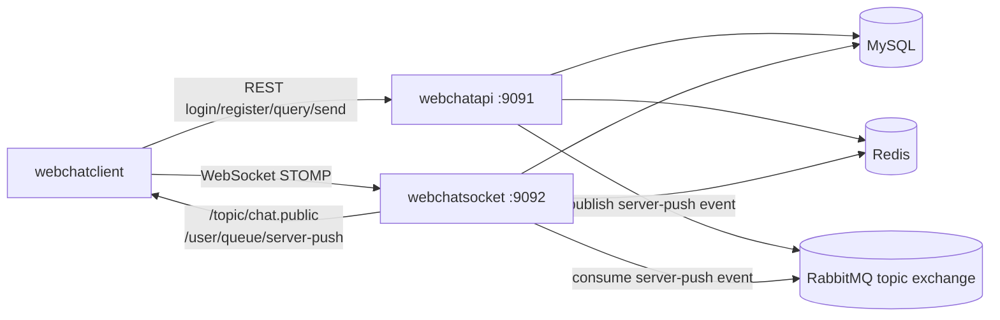

# Webchat

Webchat 是一個即時公開聊天室範例專案，包含靜態前端、REST API 服務、WebSocket/STOMP 服務，以及本機開發用的 MySQL、Redis、RabbitMQ 基礎設施。使用者可以註冊、登入取得 JWT，透過 REST API 送出訊息，再由 RabbitMQ 將事件分送到 WebSocket 節點，最後推播給已連線的聊天室使用者。

## 專案組成

| 路徑 | 說明 |
| --- | --- |
| `webchatclient/` | 純 HTML/CSS/JavaScript 前端，預設連線到 `http://localhost:9091` 與 `ws://localhost:9092/ws`。 |
| `webchatapi/` | Spring Boot REST API，負責帳號、使用者、訊息送出、聊天室成員與歷史事件查詢。 |
| `webchatsocket/` | Spring Boot WebSocket/STOMP 服務，負責連線驗證、線上狀態、healthcheck 與伺服器推播。 |
| `data/mysql/init.sql` | MySQL 初始化腳本，建立 `webchat` 與 `webchat_test` 資料庫及基本資料表。 |
| `webchatapi.dockerfile` | API 服務容器映像建置檔。 |
| `webchatsocket.dockerfile` | Socket 服務容器映像建置檔。 |
| `webchatk8s/` | Kubernetes 部署與基礎設施範例設定。 |

## 架構概覽



主要資料流：

1. 使用者在前端註冊或登入，API 回傳 JWT access token。
2. 前端帶著 token 連線到 `webchatsocket` 的 `/ws` STOMP endpoint。
3. 使用者送出聊天訊息時，前端呼叫 `webchatapi` 的 `POST /api/messages`。
4. API 建立聊天事件並發布到 RabbitMQ topic exchange。
5. Socket 服務消費 RabbitMQ 事件，推播到 `/topic/chat.public` 或指定使用者 queue。
6. 前端接收即時訊息，也會查詢近期聊天室事件與線上成員狀態。

## 技術棧

- Java 25
- Spring Boot 4.0.6
- Maven Wrapper
- MyBatis
- MySQL 8.0
- Redis 7
- RabbitMQ 4
- STOMP over WebSocket
- JWT/JWS token 驗證
- 原生 HTML、CSS、JavaScript 前端

## 前置需求

- Docker，可用於建置映像或自行啟動本機基礎服務
- JDK 25
- 可執行 Maven Wrapper 的 shell：Windows 使用 `mvnw.cmd`，Linux/macOS 使用 `./mvnw`

## 快速開始

### 1. 準備本機基礎服務

請先以 Docker、Docker Compose、Minikube 或其他方式啟動 MySQL、Redis 與 RabbitMQ。本專案目前未附 `docker-compose.yml`；若使用 Docker Compose，請自行建立等價的本機基礎服務設定。

dev profile 預設會連線到下列本機位址：

| 服務 | 連線資訊 |
| --- | --- |
| MySQL | `localhost:3306`，資料庫 `webchat` |
| Redis | `localhost:6379` |
| RabbitMQ AMQP | `localhost:5672` |

MySQL 初始化 schema 可參考 `data/mysql/init.sql`。如果改用 Kubernetes，請參考 `webchatk8s/infra-kit.yml` 建立開發用基礎設施。

### 2. 啟動 API 服務

```powershell
cd webchatapi
.\mvnw.cmd spring-boot:run -Pdev
```

API 預設啟動於：`http://localhost:9091`

### 3. 啟動 Socket 服務

另開一個終端機：

```powershell
cd webchatsocket
.\mvnw.cmd spring-boot:run -Pdev
```

Socket 預設啟動於：`ws://localhost:9092/ws`

### 4. 開啟前端

直接用瀏覽器開啟：

```text
webchatclient/index.html
```

前端預設會使用：

- REST API base URL：`http://localhost:9091`
- WebSocket URL：`ws://localhost:9092/ws`
- 公開聊天室訂閱：`/topic/chat.public`
- healthcheck publish：`/app/healthcheck`
- healthcheck 訂閱：`/user/queue/healthcheck`
- server push 訂閱：`/user/queue/server-push`

## 常用 API

### Auth

| 方法 | 路徑 | 說明 |
| --- | --- | --- |
| `POST` | `/api/auth/register` | 註冊帳號並建立使用者。 |
| `POST` | `/api/auth/login` | 登入並取得 access token。 |

### Users

| 方法 | 路徑 | 說明 |
| --- | --- | --- |
| `POST` | `/api/users` | 建立使用者。 |
| `GET` | `/api/users/{userId}` | 查詢單一使用者，需帶 `requestId` query string。 |
| `GET` | `/api/users` | 查詢使用者清單，支援 `username`、`page`、`size`。 |
| `PUT` | `/api/users/{userId}` | 更新使用者。 |
| `DELETE` | `/api/users/{userId}` | 刪除使用者，需帶 `requestId` query string。 |

### Chat

| 方法 | 路徑 | 說明 |
| --- | --- | --- |
| `POST` | `/api/messages` | 送出公開聊天室訊息，需要 `Authorization: Bearer <token>`。 |
| `GET` | `/api/chat/events` | 查詢近期聊天室事件，需要 `requestId` 與 Bearer token，可用 `limit` 控制筆數。 |
| `GET` | `/api/chat/members` | 查詢目前聊天室成員，需要 `requestId` 與 Bearer token。 |
| `GET` | `/api/online-count` | 查詢目前線上數。 |
| `GET` | `/api/online-users` | 查詢目前線上 session 清單。 |

### WebSocket / STOMP

| 類型 | 目的地 | 說明 |
| --- | --- | --- |
| Endpoint | `/ws` | WebSocket STOMP 連線入口。 |
| Publish | `/app/healthcheck` | 前端送出 healthcheck。 |
| Subscribe | `/user/queue/healthcheck` | 接收個人 healthcheck 回應。 |
| Subscribe | `/topic/chat.public` | 接收公開聊天室訊息。 |
| Subscribe | `/user/queue/server-push` | 接收指定使用者的 server push 事件。 |

## 設定

兩個後端模組都提供 `dev` 與 `prod` profile，預設使用 `dev`。主要設定檔位於：

- `webchatapi/src/main/resources/dev/application.properties`
- `webchatapi/src/main/resources/prod/application.properties`
- `webchatsocket/src/main/resources/dev/application.properties`
- `webchatsocket/src/main/resources/prod/application.properties`

常用環境變數：

| 變數 | 用途 |
| --- | --- |
| `WEBCHATAPI_PORT` | API 服務埠號，預設 `9091`。 |
| `WEBCHAT_SOCKET_PORT` | Socket 服務埠號，預設 `9092`。 |
| `WEBCHAT_SOCKET_NODE_ID` | Socket 節點識別，用於多節點推播與診斷。 |
| `MYSQL_URL` | MySQL JDBC 連線字串。 |
| `MYSQL_USERNAME` | MySQL 使用者。 |
| `MYSQL_PASSWORD` | MySQL 密碼。 |
| `REDIS_HOST` | Redis host。 |
| `REDIS_PORT` | Redis port。 |
| `RABBITMQ_HOST` | RabbitMQ host。 |
| `RABBITMQ_PORT` | RabbitMQ AMQP port。 |
| `RABBITMQ_USERNAME` | RabbitMQ 使用者。 |
| `RABBITMQ_PASSWORD` | RabbitMQ 密碼。 |
| `RABBITMQ_VHOST` | RabbitMQ virtual host。 |
| `WEBCHAT_SOCKET_API_BASE_URL` | API 服務呼叫 Socket 服務 REST endpoint 的 base URL。 |
| `WEBCHAT_JWT_SECRET` | JWT/JWS 簽章密鑰；正式環境務必改用安全值。 |

`dev` profile 內的預設連線資訊只供本機開發使用。部署到正式或公開環境時，請透過環境變數、Kubernetes Secret、CI/CD secret 或外部 Secret 管理工具注入資料庫密碼、RabbitMQ 密碼與 JWT 簽章密鑰，不要沿用範例值。

## 建置與測試

### 執行測試

```powershell
cd webchatapi
.\mvnw.cmd test
```

```powershell
cd webchatsocket
.\mvnw.cmd test
```

### 打包 dev 版本

```powershell
cd webchatapi
.\mvnw.cmd clean package -Pdev
```

```powershell
cd webchatsocket
.\mvnw.cmd clean package -Pdev
```

打包後會在各模組的 `target/` 內產生 jar、相依套件、設定檔，以及 assembly zip。zip 內容包含：

- `lib/`：應用程式 jar 與相依套件
- `config/`：對應 profile 的外部設定檔
- `run.bat` / `run.sh`：啟動腳本

### 打包 prod 版本

```powershell
cd webchatapi
.\mvnw.cmd clean package -Pprod
```

```powershell
cd webchatsocket
.\mvnw.cmd clean package -Pprod
```

## Docker 映像

API 服務：

```powershell
docker build -f webchatapi.dockerfile -t webchatapi:dev .
```

Socket 服務：

```powershell
docker build -f webchatsocket.dockerfile -t webchatsocket:dev .
```

映像預設使用 dev profile，並透過環境變數調整資料庫、Redis、RabbitMQ、JWT 與服務埠號。若服務也跑在容器網路內，請將 `localhost` 類設定改成對應的服務名稱或實際主機位址。公開或正式部署時，請在執行容器時覆蓋密碼與 JWT secret 類環境變數。

## Kubernetes

`webchatk8s/` 提供 Kubernetes 範例：

- `infra-kit.yml`：基礎設施相關資源。
- `webchat-deploy.yml`：Webchat 服務部署資源。

部署前請先檢查 image 名稱、namespace、Secret、ConfigMap、資料庫連線與 RabbitMQ/Redis 位址是否符合目標環境。`webchat-deploy.yml` 內的 `{{img-repo}}` 與 `{{img-accessKey}}` 是脫敏後的 placeholder，實際部署前需由模板流程替換，或改用 `kubectl create secret docker-registry`、External Secrets、Sealed Secrets 等方式建立映像拉取認證。

## 公開前注意事項

- 不要提交實際密碼、access token、registry pull secret、`.env`、keystore 或私鑰。
- 不要提交 Maven build output，例如 `webchatapi/target/` 與 `webchatsocket/target/`。
- 若曾經把可用憑證寫入檔案，請撤銷並重新產生該憑證；base64 編碼不等於加密。
- 正式環境請使用獨立且足夠長的 `WEBCHAT_JWT_SECRET`，API 與 Socket 服務必須使用相同 issuer、audience 與 signing secret。

## 開發備註

- MySQL 初始化腳本會建立 `webchat` 與 `webchat_test`，並授權本機開發帳號使用。
- REST API 與 WebSocket 服務需使用相同的 JWT issuer、audience 與 signing secret。
- RabbitMQ topic exchange 預設為 `webchat.server-push.topic`，Socket 服務使用 `server-push.webchatsocket.#` routing pattern 接收推播事件。
- 前端 session token 存在 `sessionStorage`，重新登入或登出會更新連線狀態。
